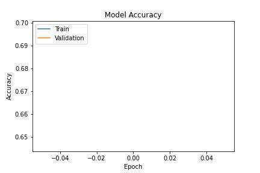
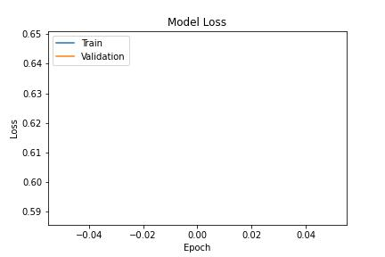
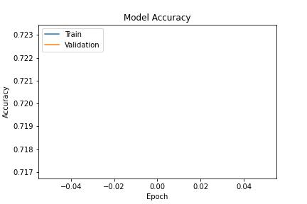
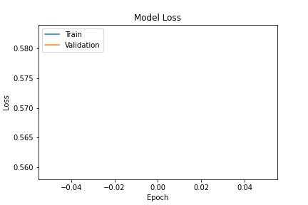
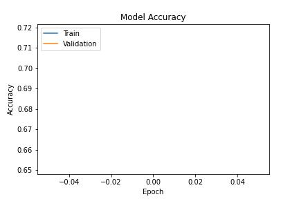
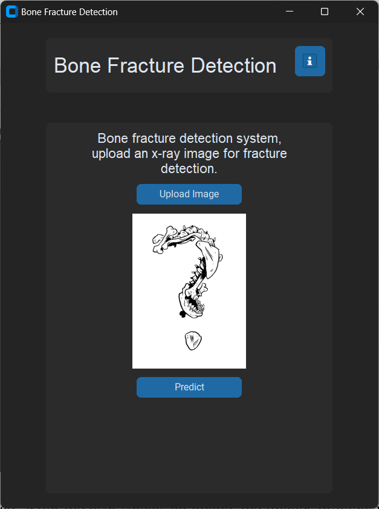

# 🦴 Bone Fracture Detection using Deep Learning

## 📌 Overview

Bone fractures have been a long-standing concern in medical diagnostics. Traditionally, fracture identification in X-ray images has heavily relied on manual inspection by radiologists — a process that may lead to oversight or human error.

With the rise of Artificial Intelligence (AI) in the medical field, we explored how Convolutional Neural Networks (CNNs) can automate and enhance fracture detection. This project investigates the application of deep learning models like **ResNet50**, **DenseNet**, and **VGG16** for classifying fractures across different bone types.

Although our best-performing models didn’t exceed the high-confidence threshold we initially aimed for, the promising results indicate strong potential. With further refinements like advanced feature extraction and model tuning, deep learning-based diagnostic systems could soon rival traditional fracture detection methods in accuracy and speed.

---

## 📂 Dataset — MURA (Musculoskeletal Radiographs)

We utilized the **MURA dataset** from Stanford, which contains over **20,000** X-ray images covering the **elbow**, **hand**, and **shoulder**.

| **Bone Type** | **Normal** | **Fractured** | **Total Images** |
| ------------- | :--------: | ------------: | ---------------: |
| Elbow         |    3,160   |         2,236 |            5,396 |
| Hand          |    4,330   |         1,673 |            6,003 |
| Shoulder      |    4,496   |         4,440 |            8,936 |

Each image belongs to a folder representing a specific patient, with 1–3 images per patient. The dataset is split into training, validation, and testing sets.

---

## 🧠 Algorithm & Model Workflow

Our approach consists of a **two-stage classification pipeline**:

1. **Bone Type Classification**
   A **AlexNet-50 model** is trained to predict whether the X-ray image shows an elbow, hand, or shoulder.

2. **Fracture Detection (per bone type)**
   Depending on the predicted bone type, a corresponding model (ResNet-based) is used to detect if a fracture is present.

### Key Steps:

* Performed data augmentation (e.g., horizontal flipping) to improve generalization.
* Preprocessed images into standardized formats suitable for training.
* Trained individual CNN classifiers for each bone type on labeled fracture data.
* Used classification confidence thresholds to determine final predictions.

This two-step system significantly improves performance by tailoring fracture detection models to specific bone types.

---

## Results

### Fracture Prediction
#### Elbow

 

#### Hand
 

#### Shoulder
 

# GUI
### Main

### Info-Rules

### Test Normal & Fractured
 

